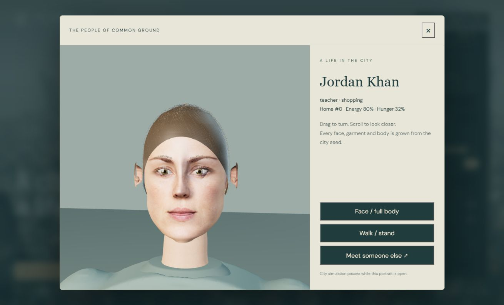
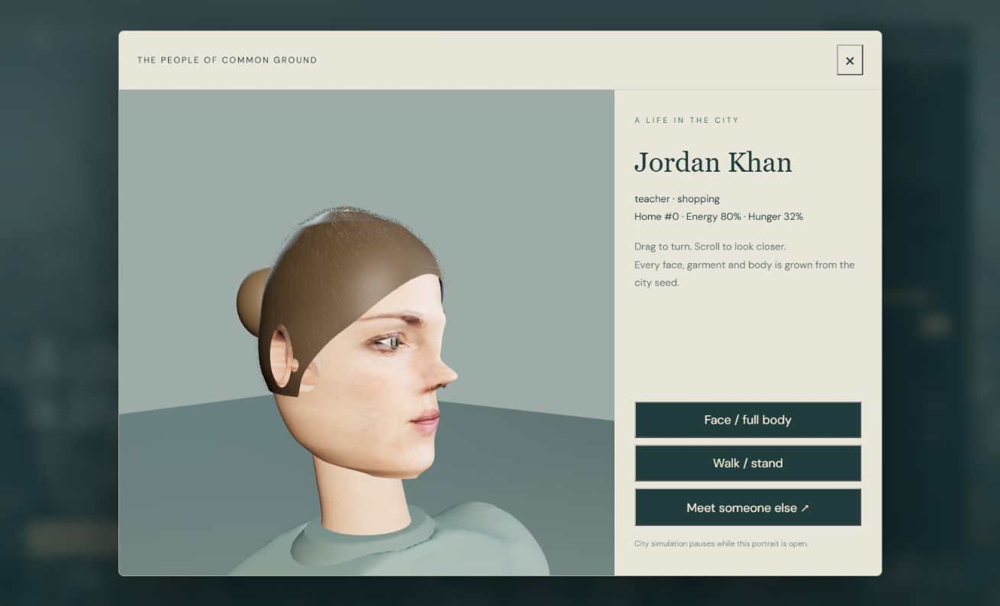

# People: realism implementation and quality gates

This pass improves the faces, materials and clothing of close residents. It pursues photorealism but does not establish photorealistic completion. Front portraits now carry original photographic pigment; side views still expose simplified anatomy and hair volumes. The screenshots are actual browser renders, not generated concept art.

## Shipped implementation

- `human-head.ts`: original anatomical cross sections and facial relief, seed variation, eye apertures, separate wet sclera/irises, shaped blink lids, lashes, brows, folded ears, nostrils, lips and individually curved hair strips. Four freshly generated photographic face plates provide local skin, wrinkle, brow and lip color. Landmark coordinates warp these plates onto the sculpt; pigment fades into procedural skin around the sides and neck. The eyes retain their own geometry rather than painted irises. Geometry variation remains seeded; four plates are a small identity vocabulary, not unlimited unique photographic faces.
- `human-materials.ts`: shared original skin microtexture, procedural pore relief and regional roughness, cloth weave, wet-eye reflections and hair fibers. The skin shader approximates wrapped diffusion and thin-tissue backscatter using shadowed incident light. It is not measured skin scattering or path-traced SSS. Generated reference images retain some illumination despite the diffuse-light prompts; they are not calibrated scans.
- `human-clothing.ts`: torso and sleeves are joined in an implicit field and extracted as one watertight mesh. The cut includes a neck aperture, rounded shoulders, hems and subtle folds. A projection query attaches buttons and the placket to the actual cloth surface. Skin weights blend across the shoulders and elbows. No cloth simulation or pose-dependent corrective morphs are claimed.
- `human-surface.ts`: 15-bone skinning, separate blink position/normal morphs, tapered fingers with knuckles and nails, continuous radius interpolation, shared UV-seam normals. `inhabitants.ts` layers damped, seeded attention changes onto the existing gait.
- `human.worker.ts` and `human-geometry.ts`: geometry construction runs in a dedicated worker. One request is in flight; completed meshes are integrated at most once per frame. Packed typed arrays, including blink normals and facial coordinates, transfer without copying. Proxies stay visible during construction. Distance hysteresis and the existing near-person budget bound skeletons and meshes. Clearing the city terminates pending work. A worker error falls back to local construction.
- `resident-studio.ts`: broad rectangular portrait lights, lower directional intensity and tighter contact-shadow bias make skin and eye response easier to inspect. The studio pauses the city while open.

## Original reconstruction experiment

The machine's RTX 5070 can run local TripoSR inference with CUDA 12.8 PyTorch. `scripts/reconstruct-person.py` reconstructs the original `people-reference.png` head. Neural inference runs on the GPU; scikit-image performs marching cubes on the CPU to avoid requiring a native CUDA extension compiler. Model weights, the isolated Python environment, tool checkout and outputs remain in ignored `.tools` / `.cache` directories. Python is not a browser/runtime dependency.

The first reconstructed head was rejected for shipping: clay renders showed ripples and rough feature geometry, and inferred color had black patches. It is not integrated into city residents. The experiment is retained as an authoring route, not described as a completed automatic production pipeline.

Official sources: [TripoSR code, model and MIT license](https://github.com/VAST-AI-Research/TripoSR), [PyTorch Blackwell support](https://pytorch.org/blog/pytorch-2-7/). Hunyuan3D 2.0 was considered but not installed; its [published license](https://github.com/Tencent-Hunyuan/Hunyuan3D-2/blob/main/LICENSE) excludes the EU.

To repeat the experiment, create an isolated Python 3.12 environment in `.tools/human-authoring`, clone the official TripoSR repository into `.tools/TripoSR`, and install CUDA-compatible PyTorch/torchvision plus `omegaconf==2.3.0`, `einops==0.7.0`, `transformers==4.35.0`, `huggingface-hub==0.17.3`, trimesh, rembg, onnxruntime, imageio and scikit-image. Run `scripts/reconstruct-person.py`. The script uses official TripoSR model weights and U2Net background preprocessing, with caches redirected into the project. Downloads are sizable; this setup is optional and independent of `npm install`. The initial evaluated run used rembg's default preprocessing; the repeatable script explicitly selects U2Net.

## Next quality gates

Photorealism needs original, well-authored neutral anatomy with consistent front/profile silhouettes; properly unfolded multi-view albedo and sculpted normal/roughness maps; more identity bases; layered hair silhouettes; expression and eye-gaze controls; and corrective deformation for the body and fitted clothes. A single photographic plate can improve pigment but cannot supply missing anatomy or realistic hair. Future reconstruction candidates should pass untextured front, side and back review before they replace the current sculpt.

Validation includes deterministic meshes, normalized finite skin weights, finite animated vertices, blink normals, bounded facial coordinates, exact worker transfer round trips and connected/watertight garment topology. Production browser review covers frontal and side portraits, several identities, walking poses, worker completion, city rendering and console errors. Frame rates are observations on this machine and configuration, not universal guarantees.

At the supplied 48×48 configuration, a production street check completed 11 near human meshes with the worker ready, eight detailed districts and no console errors. The settings panel showed 53 FPS in that observation. The local portrait screenshots also make the remaining limitations visible; [body](people-realism-body.png), [older identity](people-realism-older.png), and [street](people-realism-street.png) are retained for comparison.

Rendering references: [Three.js MeshPhysicalMaterial](https://threejs.org/docs/pages/MeshPhysicalMaterial.html), [Three.js SkinnedMesh](https://threejs.org/docs/pages/SkinnedMesh.html), [Blender Principled BSDF](https://docs.blender.org/manual/en/dev/render/shader_nodes/shader/principled.html). Original-image provenance and verbatim prompts are in [people-assets.md](people-assets.md).
